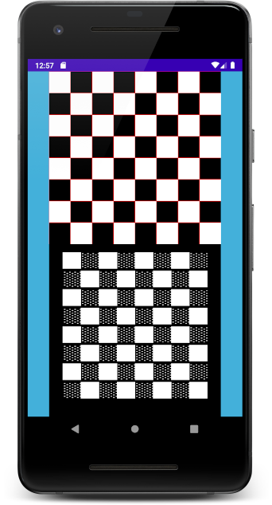

# (Ascii + Pixel) Renderer
> Renderer of graphics logic into ascii and pixels

## Table of contents
* [Purpose](#Purpose)
* [Current state of project](#CurrentStateOfProject)

## Purpose
The intention is to create two frontends - ascii and pixel, working with the same backend logic.
The challenge is to separate and abstract everything in such way that multimodule multiplatform project can be created with it.

## Current state of project
Spaghetti pixel and ascii views:

